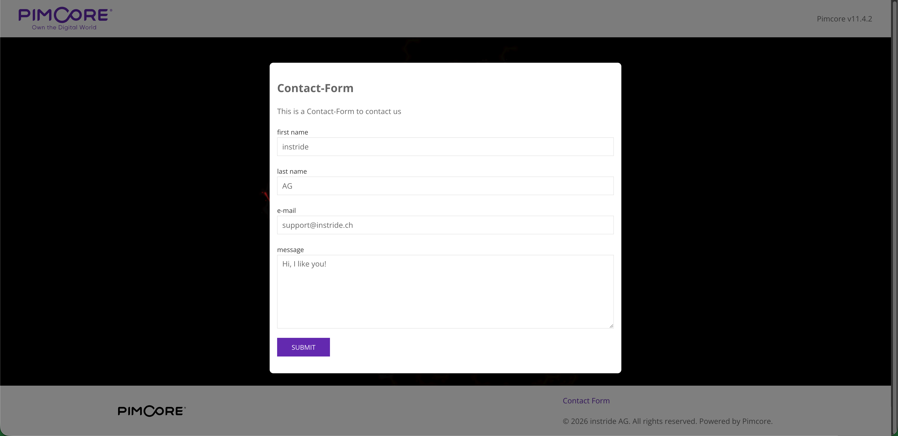
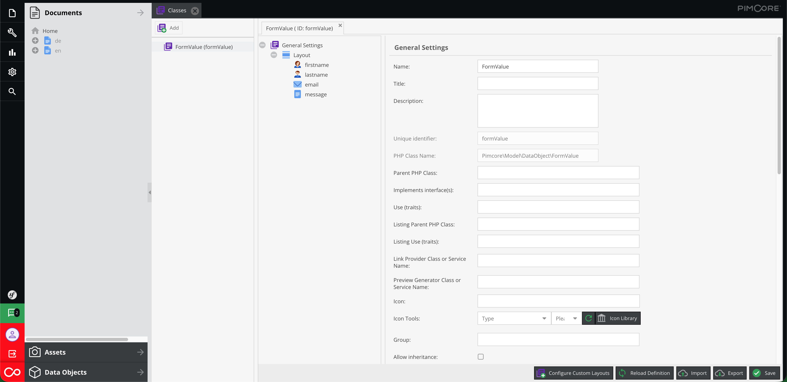
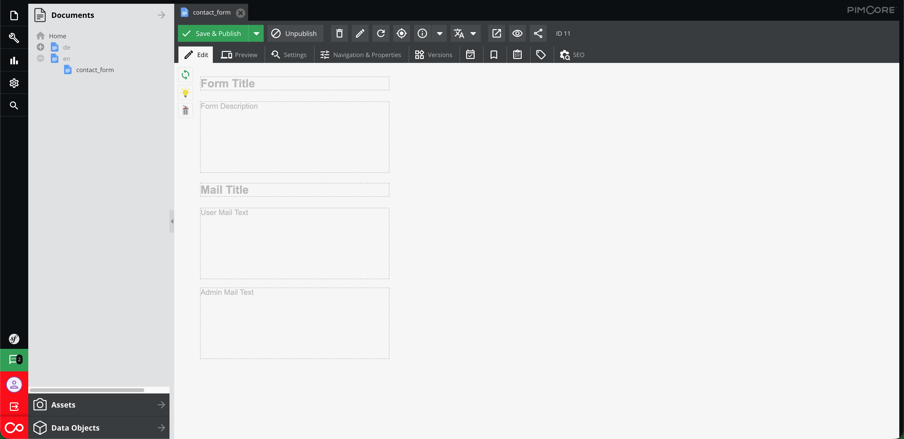
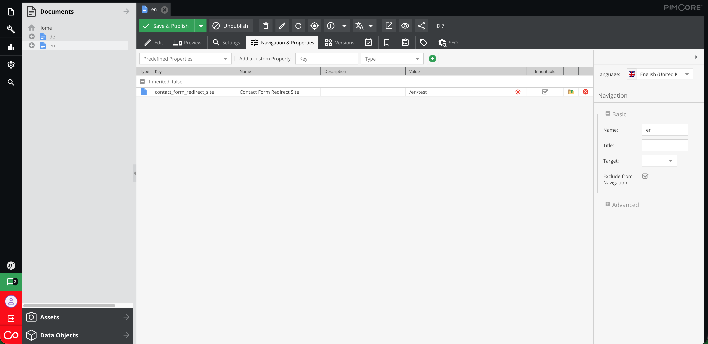
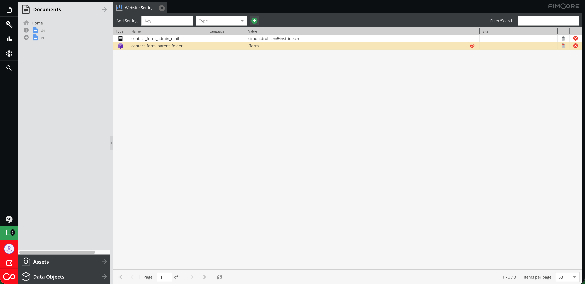
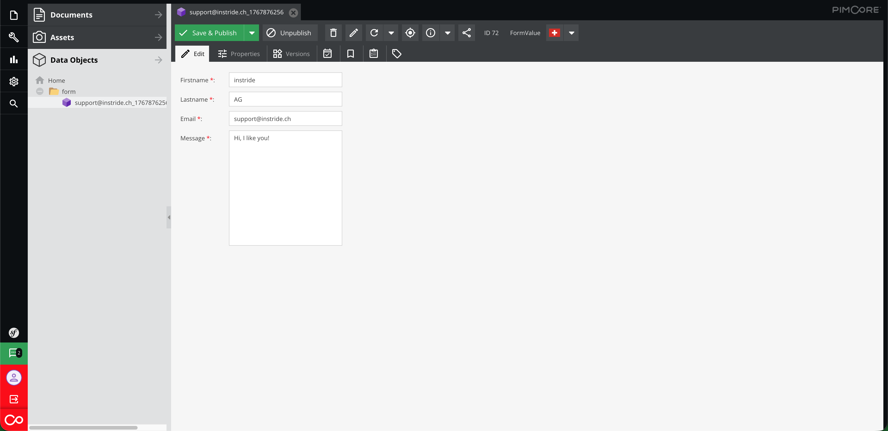

# Pimcore Contact Form Bundle

This Bundle provides a simple contact form for your website.
It allows you to easily add a contact form to any page on your site using a document in your Pimcore application.


## Features
- Simple contact form with fields for firstname, lastname, email and message.
- Basic JavaScript Form validation to ensure all fields are filled out correctly.
- Sends form submissions to a configurable email address.
- Uses Twig templates for easy customization of the form layout and styling.
- Redirects users to a configurable page after a successful submission.


## Requirements
- Pimcore `^11.0`
- Symfony/Form `^6.0`
- Symfony/Twig-Bundle `^6.0`

## Installation
You can install the Bundle via Composer:

```bash
composer require instride/contact-form
```

Then, enable the Bundle in your `config/bundles.php` file:

```php
return [
    // ...
    Instride\Bundle\ContactFormBundle\ContactFormBundle::class => ['all' => true],
];
```

You also have to add the following configuration to your `config/packages/twig.yaml` file:

```yaml
twig:
    paths:
      '%kernel.project_dir%/vendor/instride/contact-form/src/ContactFormBundle/Resources/views': ContactFormBundle
```

Before using the contact form, make sure create the FormValue Data-Object class following the template:


Add the following line to the `<head>` of your base Twig template to include the necessary assets:

```twig

```

Finally, Run the following command to install the required assets:

```bash
php bin/console assets:install
```

## Usage
To use the contact form, create a new Document with the name `contact_form` in your Pimcore admin panel. You can then add this document to any link on your site.

To configure a redirect page after a successful submission, set the `contact_form_redirect_site` property in the `Navigation & Properties` tab of the document.

In the "Website Settings" section of your Pimcore admin panel, set the following properties:

- `contact_form_admin_mail`
- `contact_form_parent_folder`

These properties will be used by the contact form to send submissions and configure the save location of the submission-objects.

